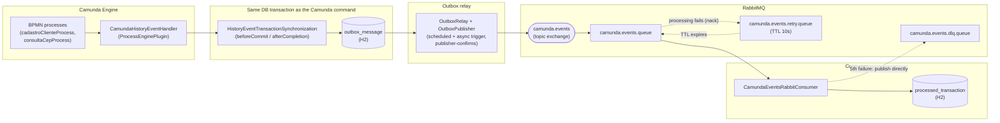
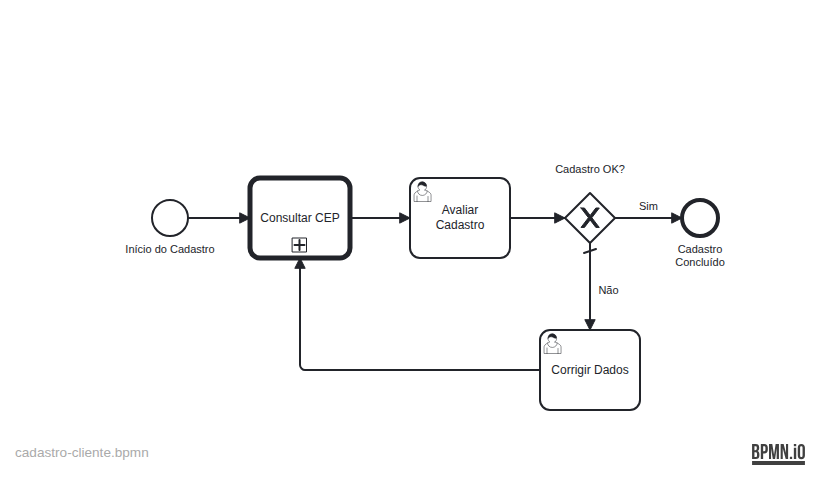
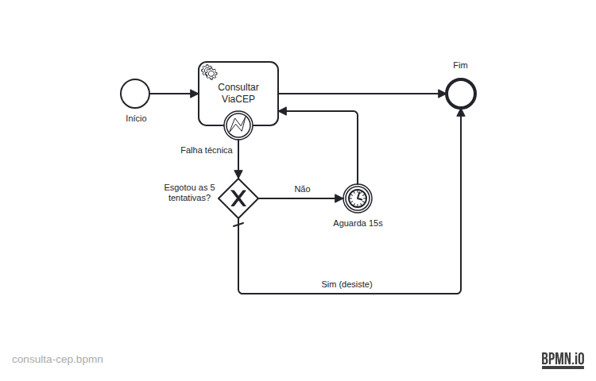
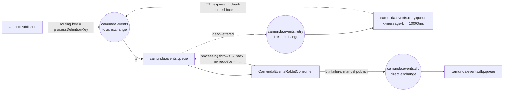
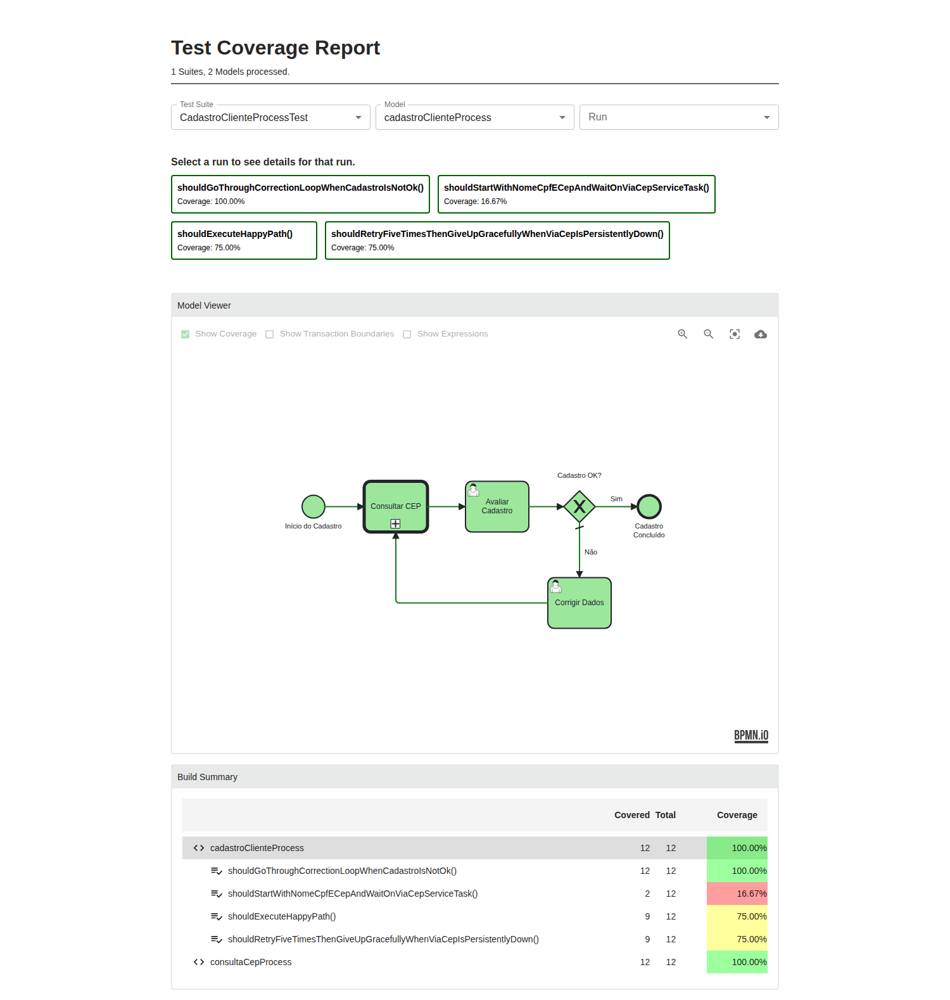

# 📬 Camunda Async Events

> 🇧🇷 Prefer Portuguese? [Read this in pt-BR](README.pt-br.md)

A small, fully working reference project that shows **one correct way** to move data out of a
Camunda 7 process — asynchronously, without losing messages, and without double-processing them
on the other side — using the **Transactional Outbox** pattern, RabbitMQ, and an idempotent
consumer.

It is deliberately built as a demo: the BPMN processes are simple (a customer registration that
looks up an address by ZIP code), but the plumbing around them — transaction handling, retry,
dead-lettering, idempotency — is built and tested to a production-grade *standard of correctness*.

**This is an architecture reference, not a production-ready artifact.** The patterns, the
transaction boundaries, and the failure-mode reasoning are meant to be copied into a real system.
The code as it stands is not: it runs as a single application instance, against an in-memory H2
database, with no schema migrations, no auth on the Camunda webapps, and no retention policy on
its own tables. See [Known limitations / trade-offs](#known-limitations--trade-offs) for exactly
where the line between "the pattern is right" and "this specific code is deployable" sits.

---

## Table of contents

- [The problem this project solves](#the-problem-this-project-solves)
- [What we are actually validating](#what-we-are-actually-validating)
- [Architecture](#architecture)
- [End-to-end walkthrough (who calls whom, what travels where)](#end-to-end-walkthrough-who-calls-whom-what-travels-where)
- [The BPMN processes](#the-bpmn-processes)
- [RabbitMQ topology: retry with backoff + DLQ](#rabbitmq-topology-retry-with-backoff--dlq)
- [Design patterns used](#design-patterns-used)
- [Tech stack](#tech-stack)
- [BPMN testing strategy](#bpmn-testing-strategy)
- [End-to-end integration test](#end-to-end-integration-test)
- [Running it locally](#running-it-locally)
- [Known limitations / trade-offs](#known-limitations--trade-offs)

---

## The problem this project solves

A process engine like Camunda knows things happen inside it — a process started, a task was
completed, a variable changed — but other systems (a notification service, an audit log, a data
lake, another microservice) usually need to know too. There are two common — and both broken —
ways people wire that up:

1. **Publish to the broker directly from a Java Delegate, inside the process transaction.**
   If the broker is down, the whole business transaction fails just because a side-channel
   notification couldn't go out. If you publish it *after* commit instead, you get the
   [dual-write problem](https://microservices.io/patterns/data/application-events.html): the
   database commit can succeed while the publish fails (crash, network blip), and the event is
   gone forever — nobody ever finds out that "customer registered" needed to be told to anyone.
2. **Poll the database for changes.** Works, but it's either slow (long poll interval) or
   wasteful (short one), and you still need to figure out exactly the same "what have I already
   sent" bookkeeping.

This project implements the standard fix — the **Transactional Outbox** pattern — wired directly
into Camunda's own transaction lifecycle:

- Every `HistoryEvent` Camunda produces during a transaction is buffered in memory.
- Right **before** that transaction commits, the buffered events are turned into one message per
  process instance and written to an `outbox_message` table, **using the same database
  connection/transaction** as the process state change itself. Either both are persisted, or
  neither is — there is no window where the process moved on but nobody was told, or vice versa.
- Only **after** the transaction has actually committed does anything attempt to talk to
  RabbitMQ. A background relay (with an low-latency "kick" right after commit, plus a periodic
  safety-net sweep) publishes pending rows and only **deletes** each one once RabbitMQ has
  **confirmed** receipt — there's no "sent" status to track: a row's mere presence in the table
  means it's still pending.
- On the receiving end, RabbitMQ is configured with a real retry-with-backoff-then-DLQ topology
  (5 attempts, 10 seconds apart, no plugins required), and the consumer is **idempotent**: every
  message carries the id of the transaction (and process instance) that produced it, and the
  consumer records that id before considering the message handled — so redelivery (which
  at-least-once messaging guarantees you *will* eventually see) never causes double processing.

## What we are actually validating

This isn't just "it compiles." Every claim above was exercised against a **real** RabbitMQ broker
(via the included `docker-compose.yml`) and a **real** running Spring Boot application, not just
mocked in a unit test:

- ✅ The event and the process state change really do land in the same DB transaction (verified by
  making the outbox write fail and confirming the process transaction rolls back with it).
- ✅ A message published to RabbitMQ is only deleted from the outbox after a **publisher
  confirm** — if the broker never confirms, the row stays right where it is and is retried by
  the relay.
- ✅ A genuine duplicate delivery (same transaction id, same process instance id) is silently and
  correctly ignored by the consumer.
- ✅ A **CallActivity** sub-process can share one database transaction with its parent process —
  meaning a single transaction can legitimately produce events for **two different process
  instance ids**. We proved this live, found that our first idempotency design (keyed by
  transaction id alone) incorrectly treated the second process instance's message as a duplicate
  of the first, and fixed it by making the idempotency key `(transactionId, processInstanceId)`.
  See the [walkthrough](#end-to-end-walkthrough-who-calls-whom-what-travels-where) below — this
  is the scenario it's demonstrating.
- ✅ A message that keeps failing in the consumer is retried exactly 5 times, 10 seconds apart,
  and only then routed to the DLQ — verified by reading the `x-death` header count returned by
  RabbitMQ, not just by trusting the code.
- ✅ The business-level retry loop (see below) gives up after **exactly** 5 attempts —
  not 4, not 6 — proven by a test that asserts the process is still waiting after 4 attempts and
  has moved on after the 5th.

## Architecture



Everything to the left of RabbitMQ (Camunda, the outbox table, the relay) lives in **one**
Spring Boot application. The consumer is drawn separately because conceptually it's a different
system — in this repo it happens to run in the same process, but nothing stops it from being a
separate service.

## End-to-end walkthrough (who calls whom, what travels where)

This traces one real request through every layer, including the interesting case: a
[`CallActivity`](#the-bpmn-processes) whose sub-process shares a transaction with its parent.

**1. A client starts the process:**

```bash
curl -X POST http://localhost:8080/engine-rest/process-definition/key/cadastroClienteProcess/start \
  -H "Content-Type: application/json" \
  -d '{
    "variables": {
      "nome": { "value": "Maria Silva", "type": "String" },
      "cpf":  { "value": "123.456.789-00", "type": "String" },
      "cep":  { "value": "01001-000", "type": "String" }
    }
  }'
```

**2. Camunda creates the process instance and reaches the `CallActivity` "Consultar CEP".** It's
`asyncBefore`, so this is where the *first* transaction ends: a job is scheduled, and the only
history event produced so far is "process instance started". `CamundaHistoryEventHandler` buffers
it, and right before commit it's written to the outbox as one message (transaction `T1`):

```json
{
  "transactionId": "b7e4a1c2-9f3d-4e21-8a6b-1c2d3e4f5061",
  "processInstanceId": "40900228-877c-11f1-9a4d-f27759d3d018",
  "processDefinitionKey": "cadastroClienteProcess",
  "processDefinitionVersion": 1,
  "state": "ACTIVE",
  "startTime": "2026-07-24T13:25:15.203-0300",
  "tasks": [],
  "variables": {
    "nome": "Maria Silva",
    "cpf": "123.456.789-00",
    "cep": "01001-000"
  }
}
```

**3. The job executor picks up the CallActivity job.** This is where it gets interesting: entering
the `CallActivity` **synchronously** starts a whole separate process instance
(`consultaCepProcess`), runs `ViaCepDelegate` (a real HTTP call to ViaCEP), and — on success —
returns control to the parent, which continues on to the "Avaliar Cadastro" user task (a wait
state). **All of that happens in one single database transaction** (`T2`), because nothing in
that chain is asynchronous. That one transaction produces history events for **two different
process instances**, so the aggregator emits **two messages**, both stamped with the same
`transactionId`:

```json
// message A — the CHILD process instance (consultaCepProcess)
{
  "transactionId": "c2278bc2-9457-4fa1-8c37-aec021388b26",
  "processInstanceId": "409d2194-877c-11f1-9a4d-f27759d3d018",
  "processDefinitionKey": "consultaCepProcess",
  "processDefinitionVersion": 1,
  "state": "COMPLETED",
  "startTime": "2026-07-24T13:25:15.493-0300",
  "endTime": "2026-07-24T13:25:16.340-0300",
  "durationInMillis": 847,
  "tasks": [],
  "variables": {
    "cep": "01001000",
    "rua": "Praça da Sé",
    "bairro": "Sé",
    "cidade": "São Paulo",
    "uf": "SP",
    "complemento": "lado ímpar",
    "endereco_encontrado": true
  }
}
```

```json
// message B — the PARENT process instance (cadastroClienteProcess), same transaction
{
  "transactionId": "c2278bc2-9457-4fa1-8c37-aec021388b26",
  "processInstanceId": "40900228-877c-11f1-9a4d-f27759d3d018",
  "processDefinitionKey": "cadastroClienteProcess",
  "processDefinitionVersion": 1,
  "state": "ACTIVE",
  "tasks": [
    {
      "id": "9af02d61-8779-11f1-9020-f27759d3d018",
      "taskDefinitionKey": "Task_AvaliarCadastro",
      "name": "Avaliar Cadastro",
      "eventType": "create",
      "assignee": null
    }
  ],
  "variables": {
    "cep": "01001000",
    "rua": "Praça da Sé",
    "bairro": "Sé",
    "cidade": "São Paulo",
    "uf": "SP",
    "complemento": "lado ímpar",
    "endereco_encontrado": true
  }
}
```

**4. Both rows are inserted into `outbox_message` inside transaction `T2`** — same connection the
process engine itself is using, via `beforeCommit`. If the insert failed, the process's own state
change would roll back with it.

**5. `afterCompletion` fires once `T2` has committed** and asynchronously kicks `OutboxRelay` with
the exact two rows just written (the actual entities, no query — just what this transaction
produced). A scheduled sweep separately re-checks every row still sitting in `outbox_message`
every 5 seconds as a safety net, in case the app crashed before the async kick ran. Each message
gets published to the `camunda.events` exchange with the process definition key as routing key,
and its row is only **deleted** after RabbitMQ **confirms** the publish — there's no status flag,
being in the table at all means still pending.

**6. `CamundaEventsRabbitConsumer` consumes both messages.** For each one it computes the idempotency key
`(transactionId, processInstanceId)`, checks `processed_transaction`, and — since neither pair has
been seen before — processes it and records the key. If either message were redelivered later
(broker restart, requeue, whatever), the second attempt would find the row already there and skip
straight past it, logging that it was ignored.

This is also exactly the scenario that exposed a real bug while building this project: the first
version of `processed_transaction` was keyed by `transactionId` alone. Since message A and message
B above share the same `transactionId`, the consumer *incorrectly* treated message B as a
duplicate of message A and silently dropped it — a real business event, lost, because two
different process instances happened to be born from the same commit. The fix was straightforward
once found: key idempotency by the pair, not the transaction alone.

## The BPMN processes

### `cadastroClienteProcess` — customer registration



Receives `nome`, `cpf`, `cep`. Delegates the address lookup to a `CallActivity` (see below), then
routes through a human task ("Avaliar Cadastro") and a gateway: approved goes straight to the end,
rejected goes to "Corrigir Dados" and loops back through the CallActivity again with the corrected
ZIP code.

The lookup is a `CallActivity` — not an inline service task — for two reasons: it makes the ZIP
lookup a reusable, independently testable sub-process, and it's what makes the
[multi-process-instance-per-transaction](#end-to-end-walkthrough-who-calls-whom-what-travels-where)
scenario happen in the first place, which is exactly what this repo is validating.

### `consultaCepProcess` — the business-level retry loop



`ViaCepDelegate` distinguishes two failure modes on purpose:

- **CEP not found / malformed** → business outcome, not an error. Sets `endereco_encontrado =
  false` and returns normally; the parent process routes the human to fix it.
- **Technical failure** (timeout, connection refused, 5xx) → throws a `BpmnError`
  (`VIACEP_INDISPONIVEL`), caught by a **boundary error event** on the service task.

The boundary event leads to a gateway that checks a retry counter: fewer than 5 attempts so far →
wait 15 seconds (`PT15S` timer) and try again; 5 attempts already made → give up gracefully
(`endereco_encontrado = false`) instead of blowing up the whole registration.

**Why model this in BPMN instead of just relying on Camunda's built-in job retry (3 attempts by
default)?** They solve different problems and don't conflict:

- Job retry only ever fires for an **unhandled** `RuntimeException` — it's invisible in Cockpit,
  has no configurable wait between attempts without extra config, and once exhausted it just
  becomes a stuck incident waiting for someone to notice.
- A `BpmnError` thrown by a delegate is caught by the boundary event **before** it would ever be
  treated as a job failure — job retry never even sees it. So there's no double-retrying (3
  invisible attempts *plus* 5 modeled ones): the delegate always converts the technical exception
  into a `BpmnError`, meaning the BPMN retry loop is the *only* retry path for this failure.
- Modeling it gives you a visible, controllable-cadence retry (your own 15s, not the job
  executor's), and a graceful, business-meaningful way to give up.

## RabbitMQ topology: retry with backoff + DLQ



This is the classic **TTL + dead-letter-exchange bounce** pattern — it needs no RabbitMQ plugins,
just durable queues and exchanges (see `RabbitMQTopologyConfig`):

1. A failed message is `nack`-ed without requeue, which the *main* queue's own
   `x-dead-letter-exchange` routes to the **retry** queue.
2. The retry queue doesn't have a consumer — messages just sit there until their
   `x-message-ttl` (10 seconds) expires, at which point *its* dead-letter-exchange sends them
   straight back to the main exchange for another attempt.
3. `CamundaEventsRabbitConsumer` inspects the `x-death` header (which RabbitMQ increments every time a
   message is dead-lettered) to know how many times the message has already failed on the main
   queue. Below 5, it lets the nack happen again. On the 5th failure, instead of nacking (which
   would bounce it through the retry queue yet again), it explicitly publishes the message to the
   DLQ exchange itself and acknowledges it — breaking the loop.

## Design patterns used

| Pattern | Where |
|---|---|
| **Transactional Outbox** | `outbox_message` table, written in the same DB transaction as the Camunda command (`HistoryEventTransactionSynchronization`) |
| **Polling Publisher** (+ low-latency trigger) | `OutboxRelay` — scheduled sweep every 5s, plus an async kick right after commit |
| **Idempotent Consumer** | `CamundaEventsRabbitConsumer` + `processed_transaction`, keyed by `(transactionId, processInstanceId)` |
| **Retry with backoff + Dead Letter Queue** | RabbitMQ TTL/DLX bounce topology, `x-death`-based attempt counting |
| **BPMN Boundary Error Event retry loop** (business-level retry) | `consultaCepProcess` — a business-visible, independently-timed retry, deliberately decoupled from Camunda's technical job retry |
| **Process composition via CallActivity** | `cadastroClienteProcess` calling `consultaCepProcess`, with explicit `camunda:in`/`camunda:out` variable mapping |
| **Anti-corruption DTOs** | `ProcessInstanceEventMessage` / `TaskEventMessage` — hand-mapped from Camunda's internal `HistoryEvent` classes, never extending them, so the wire contract doesn't break on a Camunda upgrade |
| **Plugin-based wiring (no service locator)** | `CamundaHistoryEventHandlerPlugin implements CamundaProcessEngineConfiguration` — a normal Spring-injected `@Component`, registered through Camunda's own `ProcessEnginePlugin` SPI |

## Tech stack

| Component | Version |
|---|---|
| Java | 21 |
| Spring Boot | 3.5.16 |
| Camunda Platform 7 | 7.23.0 |
| RabbitMQ | 3.13 (management image) |
| H2 Database | in-memory, shared by Camunda and the app's own JPA entities |
| Hibernate ORM | 6.6.x (via Spring Boot) |
| camunda-bpm-junit5 | 7.23.0 |
| camunda-bpm-assert | 15.0.0 |
| camunda-process-test-coverage | 2.8.1 |
| Testcontainers (RabbitMQ module) | managed by Spring Boot's dependency management |

Main runtime dependencies: `spring-boot-starter-web`, `spring-boot-starter-data-jpa`,
`spring-boot-starter-amqp`, `camunda-bpm-spring-boot-starter` (+ `-rest`, `-webapp`), `h2`,
`lombok`.

## BPMN testing strategy

Tests live in `CadastroClienteProcessTest` and run against a **standalone, in-memory** process
engine — not the full Spring Boot application context — which is what keeps them fast (the whole
suite runs in ~1.5s) and deterministic:

- `@ExtendWith(ProcessEngineCoverageExtension.class)` boots the engine *and* tracks which BPMN
  flow nodes were actually exercised — an HTML coverage report is generated per test run at
  `target/process-test-coverage/<TestClass>/report.html`.
- `src/test/resources/camunda.cfg.xml` configures the engine with
  `ProcessCoverageInMemProcessEngineConfiguration`, a `MockExpressionManager` (so
  `delegateExpression="${viaCepDelegate}"` resolves against `Mocks.register(...)` instead of a
  Spring context), and `jobExecutorActivate=false` — jobs are executed **manually**, on demand.
- `FakeViaCepDelegate` and `AlwaysFailingViaCepDelegate` stand in for the real HTTP-calling
  delegate, so tests never hit the real ViaCEP API and can deterministically force the failure
  path.
- Because jobs (async continuations *and* timers) are executed manually via
  `managementService().executeJob(id)`, the test that proves the business-level retry loop gives up after
  **exactly** 5 attempts — not 4, not 6 — runs instantly, without waiting for five real 15-second
  timers. That's also how the async `CallActivity` job is advanced in the other tests.

Every test run regenerates an HTML coverage report per BPMN model at
`target/process-test-coverage/<TestClass>/report.html`, overlaying in green exactly which flow
nodes each test (and the suite as a whole) actually walked through:



What's covered:

| Test | Proves |
|---|---|
| `shouldStartWithNomeCpfECepAndWaitOnViaCepServiceTask` | Input variables are set correctly; process parks at the `CallActivity`'s async boundary |
| `shouldExecuteHappyPath` | Full flow from start to a successful, approved registration |
| `shouldGoThroughCorrectionLoopWhenCadastroIsNotOk` | Rejected registration loops back through the ZIP lookup with corrected data |
| `shouldRetryFiveTimesThenGiveUpGracefullyWhenViaCepIsPersistentlyDown` | The BPMN retry loop attempts exactly 5 times, then degrades gracefully instead of failing the whole process |

## End-to-end integration test

`CamundaAsyncEventsEndToEndIT` is the test that actually proves the pipeline from the
[walkthrough](#end-to-end-walkthrough-who-calls-whom-what-travels-where) above — no mocks, no
standalone engine. It boots the **full** Spring Boot application (`@SpringBootTest`, real servlet
container, real job executor) against a **real RabbitMQ**, started on demand by
[Testcontainers](https://testcontainers.com/): nobody needs to remember `docker compose up` first,
just have Docker available.

It starts `cadastroClienteProcess` with a real ZIP code, lets the real ViaCEP API answer, and
asserts against the live system — the child process instance created by the `CallActivity`, both
`processed_transaction` rows, the outbox draining to empty — then manually republishes one message
to prove a redelivery is ignored. Since a confirmed row is deleted (not just flagged) from
`outbox_message`, the test can't read the sent message back from the table afterward; it binds an
extra, test-only queue to the same exchange before starting the process, purely to capture a raw
copy of everything published, and pulls the message it needs from there. Each phase logs a `===`
checkpoint, so running it narrates the whole chain, in order, on the console:

```
=== 0) abrindo uma fila auxiliar ligada no mesmo exchange ("#"), so pra capturar uma copia crua de cada mensagem publicada - nao depende da linha do outbox sobreviver ao envio, ja que ela e apagada assim que o RabbitMQ confirma ===
=== 1) iniciando cadastroClienteProcess (nome, cpf, cep) ===
processInstanceId (pai) = 2e149a08-8788-11f1-a4b7-f27759d3d018
=== 2) esperando o job assincrono da CallActivity + o ViaCEP real completarem e o processo chegar em 'Avaliar Cadastro' ===
processInstanceId (filho, consultaCepProcess) = 2e253be4-8788-11f1-a4b7-f27759d3d018
=== 3) esperando outbox -> RabbitMQ (publisher-confirm) -> consumer confirmarem AS DUAS processInstanceId (mesma transacao, dois processos) ===
confirmado: processed_transaction tem registro para o pai E para o filho
confirmado: outbox esvaziou (tudo foi confirmado pelo broker e apagado)
=== 4) pegando a copia crua da mensagem do filho na fila auxiliar e reenviando manualmente para provar a idempotencia ===
Mensagem (transacao=..., processInstance=...) ja processada, ignorando reentrega
confirmado: a reentrega foi ignorada, processed_transaction nao cresceu (continua em 3 registro(s))
=== fim: outbox -> RabbitMQ -> consumer -> idempotencia validados de ponta a ponta ===
```

It's an `*IT` class, not `*Test`, so it runs on `mvn verify` (via `maven-failsafe-plugin`), not the
default `mvn test`. It's slower than the BPMN suite (~15s: boots the whole Spring context, starts a
container, makes a real HTTP call) and needs Docker, so it stays out of the fast inner loop:

```bash
./mvnw verify
```

**Why is the real ViaCEP call left unmocked here, when every other test fakes it?** On purpose:
this test's one job is to prove the messaging pipeline against real infrastructure, and stubbing
out the one real dependency the demo actually has would undercut that. The trade-off is a network
dependency in the suite — acceptable here, since a `CallActivity` stuck in the
[retry loop](#the-bpmn-processes) if ViaCEP is briefly unreachable just makes the test fail fast
(bounded `await()` timeouts), not hang.

## Running it locally

```bash
# 1. Start RabbitMQ (management UI at http://localhost:15672, user/pass: camunda/camunda)
docker compose up -d

# 2. Run the app (H2 in-memory, auto-deploys both BPMN processes)
./mvnw spring-boot:run

# 3. Start a process instance
curl -X POST http://localhost:8080/engine-rest/process-definition/key/cadastroClienteProcess/start \
  -H "Content-Type: application/json" \
  -d '{"variables": {"nome": {"value": "Maria Silva", "type": "String"}, "cpf": {"value": "123.456.789-00", "type": "String"}, "cep": {"value": "01001-000", "type": "String"}}}'
```

Then watch it flow: RabbitMQ management UI (`camunda.events.queue`, `camunda.events.retry.queue`,
`camunda.events.dlq.queue`) and the application logs (`CamundaEventsRabbitConsumer` logs every message it
processes or skips as a duplicate).

Run the fast BPMN test suite:

```bash
./mvnw test
```

Or run everything, including the [end-to-end integration test](#end-to-end-integration-test)
(needs Docker, ~15s more):

```bash
./mvnw verify
```

## Known limitations / trade-offs

This is a reference for the **pattern**, not a checklist-complete production deployment. The
things below aren't oversights — they're scope cuts made deliberately to keep the demo focused —
but they are real gaps, and worth naming explicitly rather than letting "thoroughly tested" imply
more than it does.

- **Scales to exactly one application instance, on purpose.** The relational outbox table (both
  `outbox_message` and the consumer's `processed_transaction`) is the right backend for this
  pattern — that's the whole point of Transactional Outbox — but the *current relay code* assumes
  a single writer:
  - The low-latency path (`OutboxRelay.triggerAsync(List<OutboxMessage>)`) publishes **only the
    entities the transaction that just committed produced** — it's handed the exact objects from
    the in-memory `TransactionSynchronization` that wrote them, with no `SELECT` at all (deleting
    the row afterward is a targeted `DELETE ... WHERE id = ?`, not a read-then-delete). Run two
    instances and neither touches a row the other one wrote on this path — no cross-instance race
    on the common case (broker healthy, nothing crashed).
  - `OutboxRelay.relayPendingMessages()`, the scheduled sweep, still has to query broadly
    (`findAllByOrderById()`, no origin filter, no status to filter by since there isn't one) —
    that's the only way a surviving instance can rescue a row an instance that crashed mid-flight
    never got to publish. Run two instances (or even just the sweep racing the low-latency path
    for the same freshly-committed row *within* one instance) and both can try to publish the
    same row at the same time — not incorrect end-to-end (the consumer is idempotent, and the
    delete that follows is a plain `DELETE ... WHERE id = ?` that no-ops harmlessly if the row is
    already gone) but wasteful. Deliberately left unguarded, even within a single JVM: a lock here
    would have to wrap the RabbitMQ publish-confirm wait itself, serializing every commit's publish
    behind whatever else happens to be publishing at that moment — a bigger cost than the rare
    duplicate it would prevent, especially since that same duplicate is already tolerated,
    unguarded, across instances.
  - That same sweep query has no `LIMIT`/pagination — every cycle loads *all* remaining rows into
    memory. Fine at demo volume; a real backlog (e.g. after a broker outage) needs batching.
  - Getting the sweep to real multi-instance horizontal scaling means row-level claiming (e.g.
    `SELECT ... FOR UPDATE SKIP LOCKED`) instead of the current unguarded read, plus a bounded
    query.
- **No schema migrations.** `spring.jpa.hibernate.ddl-auto=update` against H2 in-memory is
  convenient for a demo that resets on every run; a real deployment needs Flyway/Liquibase.
  (`outbox_message` doesn't need an extra index for the sweep's query — it just orders by the
  primary key, already indexed by definition — since there's no status column to filter by:
  a confirmed row is deleted, not flagged, so every remaining row is implicitly pending.)
- **No retention/archiving policy for `processed_transaction`.** `outbox_message` is self-pruning
  now — a row only exists while pending, and is deleted the moment it's confirmed sent — but the
  consumer's idempotency table has no such cleanup: every `(transactionId, processInstanceId)`
  pair it has ever seen stays there forever. The lookup itself stays fast (it's a primary-key
  hit), but unbounded storage growth is a real production concern that isn't addressed here.
- **Cockpit/Tasklist authentication isn't configured yet** — `camunda.bpm.admin-user` is absent
  from `application.properties`, so the webapps are deployed but there's no user to log in with.
  The REST API and RabbitMQ management UI are fully usable in the meantime.
- **`ViaCepDelegate` calls the real ViaCEP API** in production code — by design, so the demo is
  genuinely end-to-end; tests substitute it with fakes, as described above.

## License

[MIT](LICENSE)
