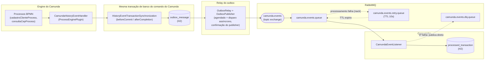
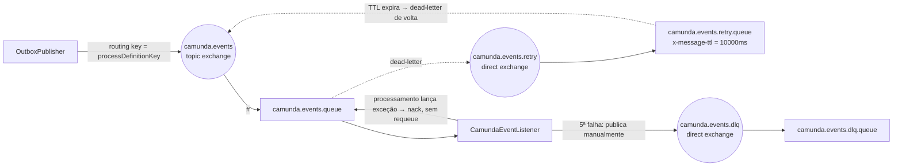

# Camunda Async Events

> 🇺🇸 Prefer English? [Read this in English](README.md)

Um projeto de referência pequeno e totalmente funcional que mostra **uma forma correta** de tirar
dados de dentro de um processo Camunda 7 — de forma assíncrona, sem perder mensagens e sem
processá-las em duplicidade do outro lado — usando o padrão **Transactional Outbox**, RabbitMQ e
um consumidor idempotente.

É construído deliberadamente como uma demonstração: os processos BPMN são simples (um cadastro de
cliente que busca o endereço a partir do CEP), mas a engrenagem ao redor deles — transação, retry,
dead-lettering, idempotência — é de qualidade produtiva e bem testada.

---

## Sumário

- [O problema que este projeto resolve](#o-problema-que-este-projeto-resolve)
- [O que estamos validando de fato](#o-que-estamos-validando-de-fato)
- [Arquitetura](#arquitetura)
- [Passo a passo ponta a ponta (quem chama quem, o que passa por onde)](#passo-a-passo-ponta-a-ponta-quem-chama-quem-o-que-passa-por-onde)
- [Os processos BPMN](#os-processos-bpmn)
- [Topologia do RabbitMQ: retry com backoff + DLQ](#topologia-do-rabbitmq-retry-com-backoff--dlq)
- [Design patterns utilizados](#design-patterns-utilizados)
- [Stack técnica](#stack-técnica)
- [Estratégia de testes de BPMN](#estratégia-de-testes-de-bpmn)
- [Rodando localmente](#rodando-localmente)
- [Limitações conhecidas / próximos passos](#limitações-conhecidas--próximos-passos)

---

## O problema que este projeto resolve

Um motor de processos como o Camunda sabe que coisas acontecem dentro dele — um processo começou,
uma tarefa foi concluída, uma variável mudou — mas outros sistemas (um serviço de notificação, um
log de auditoria, um data lake, outro microsserviço) normalmente também precisam saber. Existem
duas formas comuns — e as duas quebradas — de resolver isso:

1. **Publicar direto no broker a partir de uma Java Delegate, dentro da transação do processo.**
   Se o broker estiver fora do ar, a transação de negócio inteira falha só porque uma notificação
   de canal lateral não conseguiu sair. Se em vez disso você publicar *depois* do commit, você cai
   no [problema da escrita dupla](https://microservices.io/patterns/data/application-events.html)
   (dual-write): o commit no banco pode ter sucesso enquanto a publicação falha (crash, instabilidade
   de rede), e o evento se perde para sempre — ninguém nunca fica sabendo que "cliente cadastrado"
   precisava ser avisado a alguém.
2. **Fazer polling no banco de dados atrás de mudanças.** Funciona, mas ou é lento (intervalo de
   polling longo) ou desperdiça recursos (intervalo curto), e você ainda precisa resolver
   exatamente o mesmo controle de "o que eu já enviei".

Este projeto implementa a correção padrão — o padrão **Transactional Outbox** — conectado
diretamente ao ciclo de vida da própria transação do Camunda:

- Todo `HistoryEvent` que o Camunda produz durante uma transação é acumulado em memória.
- Bem **antes** dessa transação ser commitada, os eventos acumulados viram uma mensagem por
  instância de processo e são gravados numa tabela `outbox_message`, **usando a mesma
  conexão/transação de banco** que a própria mudança de estado do processo. Ou os dois são
  persistidos, ou nenhum é — não existe uma janela em que o processo avançou mas ninguém foi
  avisado, nem o contrário.
- Só **depois** que a transação realmente foi commitada é que algo tenta falar com o RabbitMQ. Um
  relay em segundo plano (com um "empurrão" de baixa latência logo após o commit, mais uma
  varredura periódica de segurança) publica as linhas pendentes e só as marca como `SENT` depois
  que o RabbitMQ **confirma** o recebimento.
- Do lado de quem recebe, o RabbitMQ está configurado com uma topologia de verdade de
  retry-com-backoff-depois-DLQ (5 tentativas, 10 segundos entre elas, sem precisar de plugins), e o
  consumidor é **idempotente**: toda mensagem carrega o id da transação (e da instância de
  processo) que a gerou, e o consumidor grava esse id antes de considerar a mensagem tratada — para
  que uma reentrega (que a garantia "at-least-once" do RabbitMQ *vai* eventualmente te dar) nunca
  cause processamento em duplicidade.

## O que estamos validando de fato

Isso não é só "compilou". Toda afirmação acima foi exercitada contra um broker RabbitMQ **real**
(via o `docker-compose.yml` incluído) e uma aplicação Spring Boot **real** rodando, não só
mockada num teste unitário:

- ✅ O evento e a mudança de estado do processo realmente caem na mesma transação de banco
  (verificado fazendo a escrita no outbox falhar e confirmando que a transação do processo também
  desfaz junto).
- ✅ Uma mensagem publicada no RabbitMQ só é marcada como `SENT` depois de uma **confirmação do
  publisher** — se o broker nunca confirma, a linha continua `PENDING` e é retentada pelo relay.
- ✅ Uma reentrega genuinamente duplicada (mesmo id de transação, mesmo id de instância de
  processo) é ignorada silenciosa e corretamente pelo consumidor.
- ✅ Uma sub-instância de **CallActivity** pode compartilhar uma transação de banco com o processo
  pai — ou seja, uma única transação pode legitimamente gerar eventos para **duas
  processInstanceId diferentes**. Provamos isso ao vivo, descobrimos que nosso primeiro desenho de
  idempotência (chaveado só pelo id da transação) tratava incorretamente a mensagem da segunda
  instância de processo como duplicata da primeira, e corrigimos fazendo a chave de idempotência
  ser `(transactionId, processInstanceId)`. Veja o [passo a passo](#passo-a-passo-ponta-a-ponta-quem-chama-quem-o-que-passa-por-onde)
  abaixo — é exatamente esse cenário que ele demonstra.
- ✅ Uma mensagem que continua falhando no consumidor é retentada exatamente 5 vezes, 10 segundos
  entre cada uma, e só então roteada pra DLQ — verificado lendo o contador do cabeçalho `x-death`
  devolvido pelo RabbitMQ, não só confiando no código.
- ✅ O loop de retentativa em nível de BPMN ("teimosinha", veja abaixo) desiste depois de
  **exatamente** 5 tentativas — nem 4, nem 6 — provado por um teste que garante que o processo
  ainda está esperando depois de 4 tentativas e já seguiu em frente depois da 5ª.

## Arquitetura



Tudo à esquerda do RabbitMQ (Camunda, tabela outbox, relay) mora em **uma** aplicação Spring Boot.
O consumidor está desenhado separadamente porque conceitualmente é outro sistema — neste repo ele
por acaso roda no mesmo processo, mas nada impede que seja um serviço separado.

## Passo a passo ponta a ponta (quem chama quem, o que passa por onde)

Isso traça uma requisição real passando por cada camada, incluindo o caso interessante: uma
[`CallActivity`](#os-processos-bpmn) cuja sub-instância compartilha uma transação com a instância
pai.

**1. Um cliente inicia o processo:**

```bash
curl -X POST http://localhost:8080/engine-rest/process-definition/key/cadastroClienteProcess/start \
  -H "Content-Type: application/json" \
  -d '{
    "variables": {
      "nome": { "value": "Maria Silva", "type": "String" },
      "cpf":  { "value": "123.456.789-00", "type": "String" },
      "cep":  { "value": "01001-000", "type": "String" }
    }
  }'
```

**2. O Camunda cria a instância de processo e chega na `CallActivity` "Consultar CEP".** Ela é
`asyncBefore`, então é aqui que a *primeira* transação termina: um job é agendado, e o único evento
de história produzido até agora é "instância de processo iniciada". O `CamundaHistoryEventHandler`
acumula esse evento, e bem antes do commit ele é gravado no outbox como uma mensagem (transação
`T1`):

```json
{
  "transactionId": "b7e4a1c2-9f3d-4e21-8a6b-1c2d3e4f5061",
  "processInstanceId": "40900228-877c-11f1-9a4d-f27759d3d018",
  "processDefinitionKey": "cadastroClienteProcess",
  "processDefinitionVersion": 1,
  "state": "ACTIVE",
  "startTime": "2026-07-24T13:25:15.203-0300",
  "tasks": [],
  "variables": {
    "nome": "Maria Silva",
    "cpf": "123.456.789-00",
    "cep": "01001-000"
  }
}
```

**3. O job executor pega o job da CallActivity.** É aqui que fica interessante: entrar na
`CallActivity` **de forma síncrona** inicia uma instância de processo totalmente separada
(`consultaCepProcess`), executa a `ViaCepDelegate` (uma chamada HTTP de verdade para o ViaCEP) e —
em caso de sucesso — devolve o controle para o processo pai, que segue para a tarefa humana
"Avaliar Cadastro" (um estado de espera). **Tudo isso acontece numa única transação de banco**
(`T2`), porque nada nessa cadeia é assíncrono. Essa única transação produz eventos de história para
**duas processInstanceId diferentes**, então o agregador emite **duas mensagens**, ambas com o
mesmo `transactionId`:

```json
// mensagem A — a instância FILHA (consultaCepProcess)
{
  "transactionId": "c2278bc2-9457-4fa1-8c37-aec021388b26",
  "processInstanceId": "409d2194-877c-11f1-9a4d-f27759d3d018",
  "processDefinitionKey": "consultaCepProcess",
  "processDefinitionVersion": 1,
  "state": "COMPLETED",
  "startTime": "2026-07-24T13:25:15.493-0300",
  "endTime": "2026-07-24T13:25:16.340-0300",
  "durationInMillis": 847,
  "tasks": [],
  "variables": {
    "cep": "01001000",
    "rua": "Praça da Sé",
    "bairro": "Sé",
    "cidade": "São Paulo",
    "uf": "SP",
    "complemento": "lado ímpar",
    "endereco_encontrado": true
  }
}
```

```json
// mensagem B — a instância PAI (cadastroClienteProcess), mesma transação
{
  "transactionId": "c2278bc2-9457-4fa1-8c37-aec021388b26",
  "processInstanceId": "40900228-877c-11f1-9a4d-f27759d3d018",
  "processDefinitionKey": "cadastroClienteProcess",
  "processDefinitionVersion": 1,
  "state": "ACTIVE",
  "tasks": [
    {
      "id": "9af02d61-8779-11f1-9020-f27759d3d018",
      "taskDefinitionKey": "Task_AvaliarCadastro",
      "name": "Avaliar Cadastro",
      "eventType": "create",
      "assignee": null
    }
  ],
  "variables": {
    "cep": "01001000",
    "rua": "Praça da Sé",
    "bairro": "Sé",
    "cidade": "São Paulo",
    "uf": "SP",
    "complemento": "lado ímpar",
    "endereco_encontrado": true
  }
}
```

**4. As duas linhas são inseridas em `outbox_message` dentro da transação `T2`** — na mesma
conexão que o próprio engine de processos está usando, via `beforeCommit`. Se o insert falhasse, a
própria mudança de estado do processo desfaria junto.

**5. `afterCompletion` dispara assim que `T2` é commitada** e aciona o `OutboxRelay` de forma
assíncrona. Ele pega toda linha `PENDING` (uma varredura agendada faz o mesmo a cada 5 segundos
como rede de segurança — cobre o caso em que a aplicação caiu antes do disparo assíncrono rodar),
publica cada uma no exchange `camunda.events` usando a chave do processo como routing key, e só
marca a linha como `SENT` depois que o RabbitMQ **confirma** a publicação.

**6. O `CamundaEventListener` consome as duas mensagens.** Para cada uma ele calcula a chave de
idempotência `(transactionId, processInstanceId)`, checa `processed_transaction`, e — como nenhum
dos dois pares já foi visto — processa e grava a chave. Se qualquer uma das mensagens fosse
reentregue depois (reinício do broker, requeue, o que for), a segunda tentativa encontraria a linha
já lá e pularia direto, registrando no log que foi ignorada.

Esse é exatamente o cenário que expôs um bug de verdade enquanto este projeto era construído: a
primeira versão de `processed_transaction` era chaveada só pelo `transactionId`. Como a mensagem A
e a mensagem B acima compartilham o mesmo `transactionId`, o consumidor tratava
*incorretamente* a mensagem B como duplicata da mensagem A e a descartava silenciosamente — um
evento de negócio de verdade, perdido, só porque duas instâncias de processo diferentes nasceram do
mesmo commit. A correção foi direta assim que encontrada: chavear a idempotência pelo par, não só
pela transação.

## Os processos BPMN

### `cadastroClienteProcess` — cadastro de cliente


Recebe `nome`, `cpf`, `cep`. Delega a busca de endereço a uma `CallActivity` (veja abaixo), depois
passa por uma tarefa humana ("Avaliar Cadastro") e um gateway: aprovado vai direto pro fim,
reprovado vai para "Corrigir Dados" e volta a passar pela CallActivity com o CEP corrigido.

A busca é uma `CallActivity` — não uma service task embutida — por dois motivos: torna a busca de
CEP uma sub-instância reutilizável e testável independentemente, e é o que faz o cenário de
[múltiplas processInstanceId numa mesma transação](#passo-a-passo-ponta-a-ponta-quem-chama-quem-o-que-passa-por-onde)
acontecer, que é exatamente o que este repositório está validando.

### `consultaCepProcess` — a "teimosinha" (retentativa persistente)


A `ViaCepDelegate` distingue dois tipos de falha de propósito:

- **CEP não encontrado / mal formado** → resultado de negócio, não é erro. Define
  `endereco_encontrado = false` e retorna normalmente; o processo pai encaminha um humano pra
  corrigir.
- **Falha técnica** (timeout, conexão recusada, 5xx) → lança um `BpmnError`
  (`VIACEP_INDISPONIVEL`), capturado por um **boundary error event** na service task.

O boundary event leva a um gateway que checa um contador de tentativas: menos de 5 tentativas até
agora → espera 15 segundos (timer `PT15S`) e tenta de novo; 5 tentativas já feitas → desiste com
elegância (`endereco_encontrado = false`) em vez de estourar o cadastro inteiro.

**Por que modelar isso em BPMN em vez de simplesmente confiar no retry nativo de job do Camunda (3
tentativas por padrão)?** Eles resolvem problemas diferentes e não conflitam:

- O retry de job só dispara para uma `RuntimeException` **não tratada** — é invisível no Cockpit,
  não tem espera configurável entre tentativas sem configuração extra, e uma vez esgotado vira só
  um incident travado esperando alguém notar.
- Um `BpmnError` lançado por uma delegate é capturado pelo boundary event **antes** de sequer ser
  tratado como falha de job — o retry de job nunca chega a ver. Então não existe retentativa dupla
  (3 tentativas invisíveis *mais* 5 modeladas): a delegate sempre converte a exceção técnica num
  `BpmnError`, o que faz do loop de retentativa em BPMN o **único** caminho de retry para essa
  falha.
- Modelar isso dá uma retentativa visível, com cadência controlável (os seus 15s, não os do job
  executor), e uma forma graciosa e com significado de negócio de desistir.

## Topologia do RabbitMQ: retry com backoff + DLQ



Este é o clássico padrão de **TTL + dead-letter-exchange fazendo ricochete** — não precisa de
nenhum plugin do RabbitMQ, só filas e exchanges duráveis (veja `RabbitMQTopologyConfig`):

1. Uma mensagem que falhou recebe `nack` sem requeue, o que a própria
   `x-dead-letter-exchange` da fila *principal* roteia para a fila de **retry**.
2. A fila de retry não tem consumidor — as mensagens simplesmente ficam lá até o
   `x-message-ttl` (10 segundos) expirar, momento em que *sua própria* dead-letter-exchange as
   manda de volta direto pro exchange principal para uma nova tentativa.
3. O `CamundaEventListener` inspeciona o cabeçalho `x-death` (que o RabbitMQ incrementa toda vez
   que uma mensagem é dead-lettered) para saber quantas vezes a mensagem já falhou na fila
   principal. Abaixo de 5, deixa o nack acontecer de novo. Na 5ª falha, em vez de dar nack (o que a
   faria ricochetear pela fila de retry mais uma vez), ele publica a mensagem diretamente no
   exchange da DLQ e confirma o processamento (ack) — quebrando o ciclo.

## Design patterns utilizados

| Padrão | Onde |
|---|---|
| **Transactional Outbox** | Tabela `outbox_message`, gravada na mesma transação de banco do comando do Camunda (`HistoryEventTransactionSynchronization`) |
| **Polling Publisher** (+ disparo de baixa latência) | `OutboxRelay` — varredura agendada a cada 5s, mais um disparo assíncrono logo após o commit |
| **Idempotent Consumer** | `CamundaEventListener` + `processed_transaction`, chaveado por `(transactionId, processInstanceId)` |
| **Retry com backoff + Dead Letter Queue** | Topologia de ricochete TTL/DLX do RabbitMQ, contagem de tentativas baseada em `x-death` |
| **Loop de retentativa via Boundary Error Event do BPMN** ("teimosinha") | `consultaCepProcess` — uma retentativa visível ao negócio, com cadência própria, deliberadamente desacoplada do retry técnico de job do Camunda |
| **Composição de processos via CallActivity** | `cadastroClienteProcess` chamando `consultaCepProcess`, com mapeamento explícito de variáveis `camunda:in`/`camunda:out` |
| **DTOs anticorrupção** | `ProcessInstanceEventMessage` / `TaskEventMessage` — mapeados manualmente a partir das classes internas `HistoryEvent` do Camunda, nunca as estendendo, para que o contrato de integração não quebre num upgrade do Camunda |
| **Conexão via plugin (sem service locator)** | `CamundaHistoryEventHandlerPlugin implements CamundaProcessEngineConfiguration` — um `@Component` injetado normalmente pelo Spring, registrado através da própria SPI `ProcessEnginePlugin` do Camunda |

## Stack técnica

| Componente | Versão |
|---|---|
| Java | 21 |
| Spring Boot | 3.5.16 |
| Camunda Platform 7 | 7.23.0 |
| RabbitMQ | 3.13 (imagem management) |
| H2 Database | em memória, compartilhado entre o Camunda e as entidades JPA da aplicação |
| Hibernate ORM | 6.6.x (via Spring Boot) |
| camunda-bpm-junit5 | 7.23.0 |
| camunda-bpm-assert | 15.0.0 |
| camunda-process-test-coverage | 2.8.1 |

Principais dependências de runtime: `spring-boot-starter-web`, `spring-boot-starter-data-jpa`,
`spring-boot-starter-amqp`, `camunda-bpm-spring-boot-starter` (+ `-rest`, `-webapp`), `h2`,
`lombok`.

## Estratégia de testes de BPMN

Os testes vivem em `CadastroClienteProcessTest` e rodam contra um engine de processos
**standalone, em memória** — não o contexto completo da aplicação Spring Boot — o que é o que os
mantém rápidos (a suíte inteira roda em ~1,5s) e determinísticos:

- `@ExtendWith(ProcessEngineCoverageExtension.class)` inicializa o engine *e* rastreia quais nós de
  fluxo do BPMN foram de fato exercitados — um relatório HTML de cobertura é gerado a cada execução
  em `target/process-test-coverage/<TestClass>/report.html`.
- `src/test/resources/camunda.cfg.xml` configura o engine com
  `ProcessCoverageInMemProcessEngineConfiguration`, um `MockExpressionManager` (para que
  `delegateExpression="${viaCepDelegate}"` resolva contra `Mocks.register(...)` em vez de um
  contexto Spring), e `jobExecutorActivate=false` — jobs são executados **manualmente**, sob
  demanda.
- `FakeViaCepDelegate` e `AlwaysFailingViaCepDelegate` substituem a delegate real que faz a
  chamada HTTP, então os testes nunca batem na API real do ViaCEP e conseguem forçar o caminho de
  falha de forma determinística.
- Como os jobs (continuações assíncronas *e* timers) são executados manualmente via
  `managementService().executeJob(id)`, o teste que prova que a "teimosinha" desiste depois de
  **exatamente** 5 tentativas — nem 4, nem 6 — roda instantaneamente, sem esperar cinco timers reais
  de 15 segundos. É assim também que o job assíncrono da `CallActivity` é avançado nos outros
  testes.

Toda execução de teste regenera um relatório HTML de cobertura por modelo BPMN em
`target/process-test-coverage/<TestClass>/report.html`, sobrepondo em verde exatamente quais nós de
fluxo cada teste (e a suíte como um todo) de fato percorreu:


O que está coberto:

| Teste | Prova |
|---|---|
| `shouldStartWithNomeCpfECepAndWaitOnViaCepServiceTask` | As variáveis de entrada são definidas corretamente; o processo para na borda assíncrona da `CallActivity` |
| `shouldExecuteHappyPath` | Fluxo completo do início a um cadastro aprovado com sucesso |
| `shouldGoThroughCorrectionLoopWhenCadastroIsNotOk` | Um cadastro reprovado volta a passar pela busca de CEP com os dados corrigidos |
| `shouldRetryFiveTimesThenGiveUpGracefullyWhenViaCepIsPersistentlyDown` | O loop de retentativa do BPMN tenta exatamente 5 vezes, depois degrada com elegância em vez de derrubar o processo inteiro |

## Rodando localmente

```bash
# 1. Sobe o RabbitMQ (management UI em http://localhost:15672, usuário/senha: camunda/camunda)
docker compose up -d

# 2. Roda a aplicação (H2 em memória, faz auto-deploy dos dois processos BPMN)
./mvnw spring-boot:run

# 3. Inicia uma instância de processo
curl -X POST http://localhost:8080/engine-rest/process-definition/key/cadastroClienteProcess/start \
  -H "Content-Type: application/json" \
  -d '{"variables": {"nome": {"value": "Maria Silva", "type": "String"}, "cpf": {"value": "123.456.789-00", "type": "String"}, "cep": {"value": "01001-000", "type": "String"}}}'
```

Depois é só acompanhar o fluxo: management UI do RabbitMQ (`camunda.events.queue`,
`camunda.events.retry.queue`, `camunda.events.dlq.queue`) e os logs da aplicação
(`CamundaEventListener` loga toda mensagem que processa ou ignora por já ter sido processada).

Rodar a suíte de testes de BPMN:

```bash
./mvnw test
```

## Limitações conhecidas / próximos passos

- **A autenticação do Cockpit/Tasklist ainda não está configurada** — `camunda.bpm.admin-user`
  está ausente do `application.properties`, então as webapps são implantadas mas não existe um
  usuário para fazer login. A API REST e a management UI do RabbitMQ estão totalmente utilizáveis
  enquanto isso.
- **`OutboxRelay.relayPendingMessages()` é `synchronized`**, o que é correto e suficiente para uma
  única instância da aplicação (o escopo desta demonstração), mas precisaria de captura em nível de
  linha (ex.: `SELECT ... FOR UPDATE SKIP LOCKED`) ou um lock distribuído para escalar para
  múltiplas instâncias sem publicar a mesma linha duas vezes.
- **A `ViaCepDelegate` chama a API real do ViaCEP** no código de produção — de propósito, para que
  a demonstração seja de ponta a ponta de verdade; os testes a substituem por fakes, como descrito
  acima.
