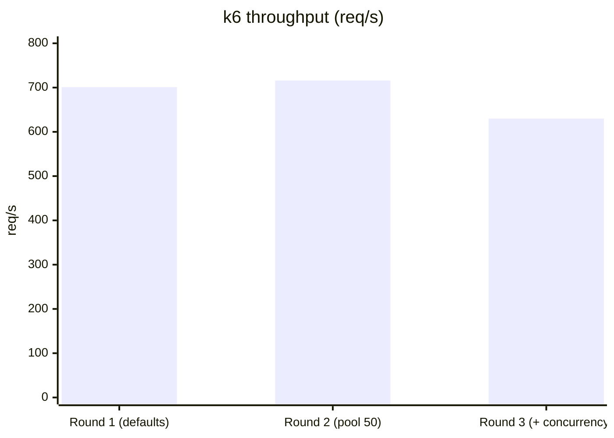
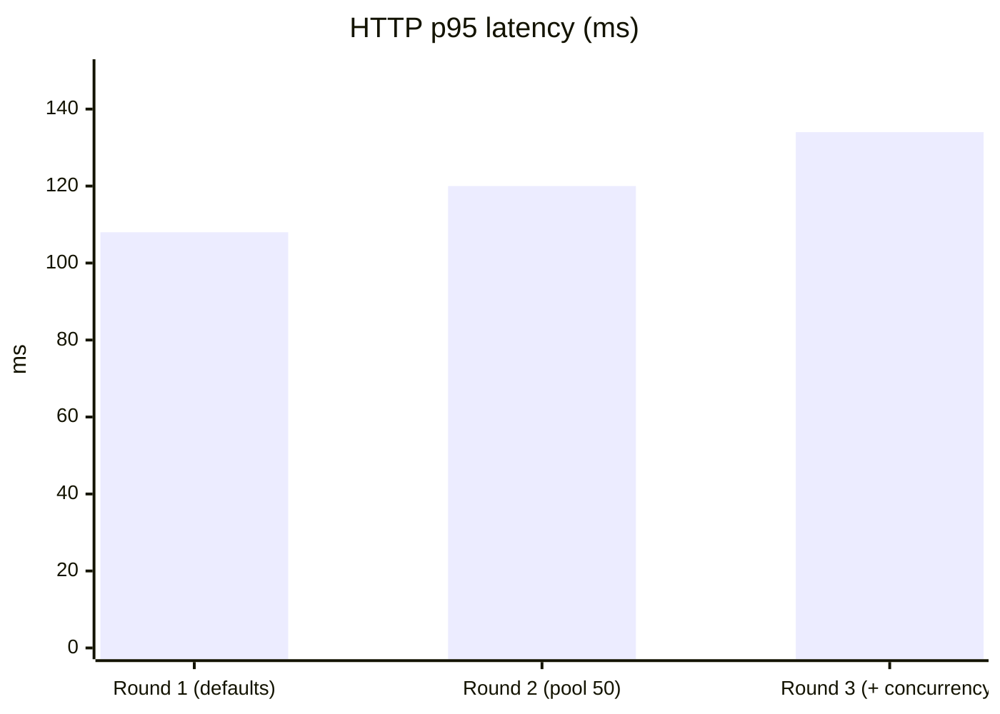
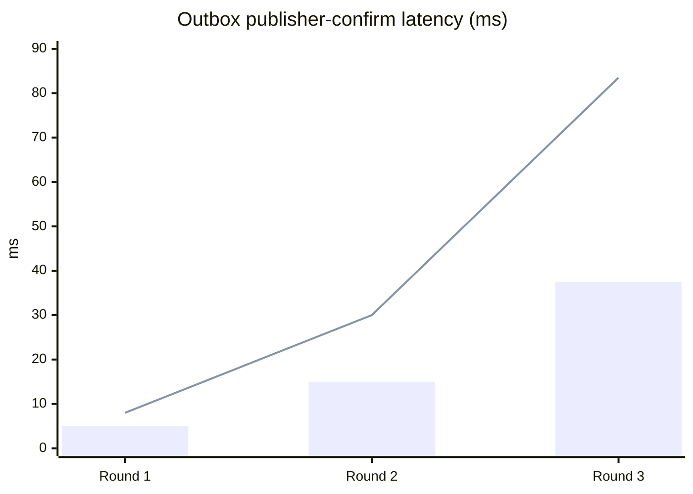
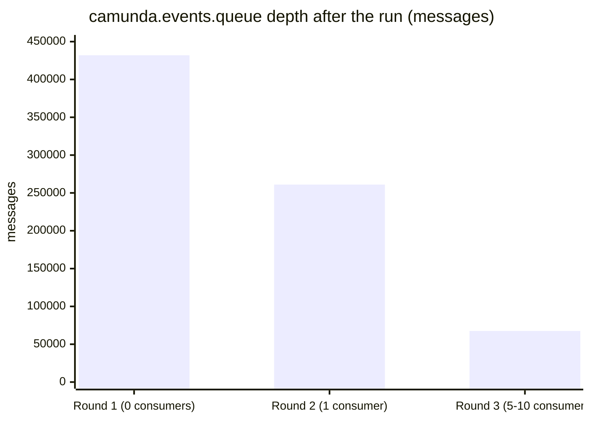
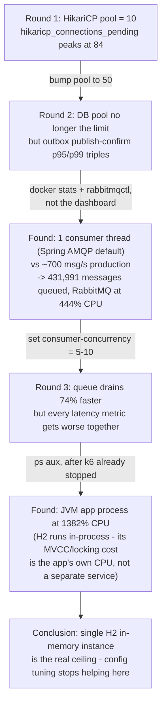

# Load test report — outbox pipeline under ramping load

**Date:** 2026-07-24
**Tooling:** [k6](https://k6.io/) (ramping scenario, `loadtest/stress-test.js`), Prometheus +
Grafana (`docker-compose.yml`), `docker stats`, `rabbitmqctl`, `ps`/`top`
**Environment:** single machine, 20 cores — app, RabbitMQ, Prometheus, Grafana, and the k6 load
generator all running locally, side by side (see [caveat](#a-methodology-caveat) at the end)

## TL;DR

Ran the same ramping load (0 → 10 → 50 virtual users, ~700 req/s peak, ~4m30s) three times,
changing one thing between each run instead of guessing. The bottleneck moved twice before
landing somewhere no config change can fix:

1. **HikariCP connection pool** (default 10) saturated first — obvious, on-dashboard.
2. Fixing that exposed a **single-threaded RabbitMQ consumer** silently defaulted by Spring AMQP
   — invisible on the custom dashboard, only visible in `rabbitmqctl list_queues` and `docker
   stats`.
3. Fixing *that* pushed every metric (latency, throughput) worse at once instead of one clearly
   climbing — the signature of a shared resource everyone's now fighting over. Process-level CPU
   confirmed it: the JVM app itself, not RabbitMQ, was the dominant consumer at up to 1382% CPU
   (~14 of 20 cores) — consistent with **H2 running in-process** and absorbing all the extra
   concurrency this session had just unlocked.

The outbox mechanism this project exists to demonstrate — the transactional write, the low-latency
publish, the sweep — was never the bottleneck in any of the three rounds. Its own metrics
(`outbox_backlog_size`, `outbox_publish_confirm_seconds`) stayed small throughout; they degraded
only as a *symptom* of contention happening one layer down, in the shared H2 instance.

## Round-by-round

### Round 1 — defaults

Spring Boot's default HikariCP pool (`maximum-pool-size=10`) against a single-threaded RabbitMQ
consumer (Spring AMQP's default when `@RabbitListener` doesn't set `concurrency`).

- `hikaricp_connections_pending` peaked at **84** threads waiting for one of 10 connections — the
  obvious, textbook signal, visible directly on the Grafana dashboard.
- `outbox_backlog_size` stayed low (max 41 rows) and `outbox_publish_confirm_seconds` p95/p99 were
  5ms / 8ms — the outbox itself had headroom to spare.

**Change made:** `spring.datasource.hikari.maximum-pool-size` 10 → 50.

### Round 2 — bigger pool

- HTTP p95 barely moved (108ms → 120ms) — the pool wasn't really gating request latency.
- `outbox_publish_confirm_seconds` p95/p99 got **3x worse** (5ms→15ms, 8ms→30ms) — a side effect,
  not an improvement: more requests could now proceed concurrently, pushing harder on whatever
  came next.
- The real story wasn't on the dashboard at all. `docker stats` showed the RabbitMQ container at
  **444% CPU**, and `rabbitmqctl list_queues` showed why: `camunda.events.queue` had **431,991**
  messages sitting there with **zero consumers** actively keeping up. `CamundaEventsRabbitConsumer`
  never set `concurrency` on its `@RabbitListener` — Spring AMQP's default is a single consumer
  thread, doing two DB round-trips per message (idempotency check + insert), nowhere near enough
  against ~700 msg/s of production.

**Change made:** `camunda.events.rabbitmq.consumer-concurrency` unset (→ 1) → `5-10`.

### Round 3 — concurrent consumer

- Queue depth after the run dropped **74%** (67,536 vs 431,991) — the concurrency fix genuinely
  helped drain the backlog.
- But HTTP p95 (120ms→134ms), publish-confirm p95/p99 (15/30ms → **37.5/83.5ms**), and even k6
  throughput itself (716→630 req/s) all got *worse*, together. Every metric degrading at once,
  instead of one clearly climbing, stopped pointing at a single component and started pointing at
  a shared resource all of them now contend for.
- `top`/`ps aux` confirmed it at the process level, captured *after* k6 had already stopped —
  the JVM app process was still at **1382% CPU** (≈14 of 20 cores), dwarfing RabbitMQ's Erlang VM
  at 42.5%. H2 runs embedded in the same JVM as the app; its MVCC/locking overhead shows up as the
  app's own CPU, spread across however many threads are now hitting it — Tomcat's request threads,
  the outbox relay, and up to 10 consumer threads, all at once, funneled into one engine with no
  horizontal write capacity to add.

**No further config change chased** — the next real step is swapping H2 for a real database,
which is a deliberate architecture change, not a tuning knob, and out of scope for this demo (see
the main [README](../README.md#known-limitations--trade-offs)).

## Charts

Peak throughput barely changed round to round — the system kept accepting ~630–720 req/s
throughout. What changed was what it cost to sustain that:





`outbox_publish_confirm_seconds` is the one metric that belongs to the pattern this project is
about — and it only got worse as *other* layers absorbed more concurrency, never because the
outbox write/publish/sweep path itself changed:



*(bars = p95, line = p99)*

The metric that actually tracked the fix that helped — consumer concurrency — wasn't on the
custom dashboard at all. It came from `rabbitmqctl list_queues`:



## How the bottleneck moved



## A methodology caveat

Load generator, application, broker, and the entire monitoring stack ran on **one machine**,
competing for the same 20 cores. That's a real limitation of this setup, not a footnote: it means
k6 itself, Docker's overhead, and the JVM under test were never fully isolated from each other.
The process-level breakdown in round 3 (JVM app at 1382% CPU vs. RabbitMQ's Erlang VM at 42.5%)
is what makes the H2-contention conclusion credible despite that — it points at one specific
process, not just "the host was busy" — but a more rigorous version of this test would run k6 from
a separate machine (or at least capture `pidstat`-style per-process CPU for every round, not just
round 3) to remove the shared-hardware confound entirely.

## Reproducing this

```bash
docker compose up -d                                          # RabbitMQ + Prometheus + Grafana
./mvnw spring-boot:run -Dspring-boot.run.profiles=loadtest     # fake ViaCEP, real everything else
k6 run loadtest/stress-test.js                                 # ~4m30s

# while it runs, or right after:
docker stats camunda-async-events-rabbitmq --no-stream
docker exec camunda-async-events-rabbitmq rabbitmqctl list_queues name messages consumers
ps aux --sort=-%cpu | head
```

See [Monitoring and load testing](../README.md#monitoring-and-load-testing) in the main README for
the full setup and what each custom metric means.
